# Ecommerce Business Flow for Source Application

## 1. Purpose

This document defines the pure business flow for a computer-hardware ecommerce source application.

The goal is to make the source application generate realistic operational changes through valid ecommerce actions instead of random mock inserts. Every action should represent a real business event such as customer registration, address creation, catalog setup, cart update, checkout, payment, shipment, inventory movement, supplier restocking, return request, inspection, and refund.

This document intentionally focuses only on the source application business domain. Technology-specific implementation details such as CDC tools, streaming platforms, processing engines, lakehouse tables, and storage layers are outside the scope of this handover.

The main handover output of this document is Section 10, **Recommended API Actions for Source Application**.

## 2. Domain Overview

The system represents an ecommerce platform that sells computer hardware such as CPUs, GPUs, RAM, SSDs, monitors, keyboards, mice, power supplies, PC cases, cooling products, and other related accessories.

The business domain must support:

- Customer account management.
- Customer address book management.
- Product catalog management.
- Brand and supplier tracking.
- Category hierarchy and product classification.
- Warehouse-level inventory.
- Inventory movement history.
- Shopping cart management.
- Order placement and order line creation.
- Payment attempt tracking.
- Shipment and delivery tracking.
- Return request and return item handling.
- Refund handling.
- Promotions and discount campaigns.
- Supplier purchase orders for restocking.


## 3. Main Business Entities


| Area        | Tables                                                   | Business meaning                                                                     |
| ----------- | -------------------------------------------------------- | ------------------------------------------------------------------------------------ |
| Customer    | `customers`, `customer_addresses`                        | Customer identity and customer address book.                                         |
| Catalog     | `brands`, `categories`, `products`, `product_categories` | Product master data, brand ownership, and category hierarchy.                        |
| Supplier    | `suppliers`, `supplier_products`                         | Supplier master data and which supplier can provide which product.                   |
| Inventory   | `warehouses`, `inventory`, `inventory_movements`         | Current stock by warehouse and historical stock changes.                             |
| Purchasing  | `purchase_orders`, `purchase_order_items`                | Restocking orders created by the ecommerce business and sent to suppliers.           |
| Cart        | `carts`, `cart_items`                                    | Customer shopping intent before order placement.                                     |
| Order       | `orders`, `order_items`                                  | Confirmed customer purchase and purchased line items.                                |
| Payment     | `payments`                                               | Payment attempts, payment success/failure, cancellation, and refund-related records. |
| Fulfillment | `shipments`                                              | Shipment lifecycle, carrier, tracking number, and delivery state.                    |
| Return      | `returns`, `return_items`                                | Customer return request and returned product lines.                                  |
| Promotion   | `promotions`                                             | Discount rules, coupon codes, and campaign validity.                                 |


## 4. Table Relationship Summary

```text
customers 1--N customer_addresses
customers 1--N carts
customers 1--N orders
customers 1--N returns

brands 1--N products

categories 1--N categories as parent-child category hierarchy
products N--N categories through product_categories

suppliers N--N products through supplier_products

warehouses 1--N inventory
products 1--N inventory

products 1--N inventory_movements
warehouses 1--N inventory_movements
orders 0--N inventory_movements
purchase_orders 0--N inventory_movements
returns 0--N inventory_movements

suppliers 1--N purchase_orders
purchase_orders 1--N purchase_order_items
products 1--N purchase_order_items

carts 1--N cart_items
products 1--N cart_items

customers 1--N orders
customer_addresses 1--N orders as shipping address
customer_addresses 1--N orders as billing address
promotions 0--N orders
orders 1--N order_items
products 1--N order_items

orders 1--N payments
orders 1--N shipments

orders 1--N returns
returns 1--N return_items
order_items 1--N return_items
products 1--N return_items
```


### 4.1 Relationship Explanation


#### Customer and address relationships

A customer can own multiple saved addresses. These addresses can represent home address, office address, billing address, or recipient address.

A single order may use one address as the shipping address and another address as the billing address. The shipping address is where the product is delivered. The billing address is the address used for payment, invoice, or tax-related information.

For a production-grade ecommerce flow, the order should preserve the address used at checkout time. If the system only stores `shipping_address_id` and `billing_address_id` as references to `customer_addresses`, historical orders may be affected when a customer later edits an address. A safer business design is to snapshot the shipping and billing address details into the order or into an order address table.

#### Category relationships

`categories 1--N categories` means a category can have child categories. For example:

```text
Computer Hardware
-> Components
   -> CPU
   -> GPU
   -> RAM
-> Peripherals
   -> Keyboard
   -> Mouse
   -> Monitor
```

`products N--N categories through product_categories` means one product can belong to multiple categories, and one category can contain many products. For example, a gaming monitor can belong to `Monitors`, `Gaming`, and `Promotion` categories at the same time.

#### Inventory relationships

`inventory` represents current stock by product and warehouse. It answers:

```text
Which product is available in which warehouse, and how many units are currently on hand or reserved?
```

A warehouse can contain many inventory records. A product can also appear in many inventory records because the same product may be stocked in multiple warehouses.

`inventory_movements` represents the historical reason why stock changed. It answers:

```text
Why did stock increase or decrease, when did it happen, and which business event caused it?
```

Inventory movements may be caused by:

- Customer order placement.
- Supplier purchase order receipt.
- Customer return receipt.
- Manual stock adjustment.
- Warehouse transfer.
- Damaged stock write-off.


#### Purchase order relationships

A supplier can receive many purchase orders. A purchase order can contain many purchase order items. Each purchase order item refers to a product, quantity ordered, quantity received, and unit cost.

This represents the business buying stock from suppliers, not customers buying products from the ecommerce store.

#### Cart relationships

A cart represents a customer’s active shopping intent before checkout. A cart can contain multiple cart items. Each cart item points to a product and stores the selected quantity and the product price snapshot at the time the item was added or updated.

#### Order relationships

An order is the confirmed purchase created from a checkout. An order contains multiple order items. Each order item stores the product, quantity, unit price, discount, and line total at purchase time.

The system must not calculate historical revenue from the current product price because product prices can change after the order is placed. Historical revenue should come from `order_items.unit_price`, `order_items.discount_amount`, and `order_items.line_total`.

#### Payment relationships

An order can have multiple payment records because real ecommerce orders may involve:

- Failed payment followed by retry.
- Split payment across gift card and card.
- Partial payment.
- Authorization followed by capture.
- Full or partial refund.

Therefore, `payments` should be treated as payment transaction history for an order, not just a single static payment field.

#### Shipment relationships

An order can have multiple shipments because products may be fulfilled from different warehouses, shipped in multiple packages, delivered in multiple phases, or reshipped after a failed delivery.

A simple order may have only one shipment, but the relationship should allow multiple shipments for realistic fulfillment scenarios.

#### Return relationships

An order can have multiple return requests. A return request can contain multiple return items. A return item should link back to the original `order_item` because the system needs to know the exact purchased line, historical price, purchased quantity, discount, and refund eligibility.

A product can appear in many return items across different customers and orders. This supports return-rate analysis and product quality monitoring.

## 5. Mermaid ERD

```mermaid
erDiagram
    customers {
        uuid customer_id PK
        string email UK
        string full_name
        string phone
        string loyalty_tier
        string status
        timestamp created_at
        timestamp updated_at
    }

    customer_addresses {
        uuid address_id PK
        uuid customer_id FK
        string address_type
        string recipient_name
        string phone
        string line1
        string line2
        string city
        string region
        string postal_code
        string country
        boolean is_default
        timestamp created_at
    }

    brands {
        uuid brand_id PK
        string brand_name UK
        string country
        timestamp created_at
    }

    categories {
        uuid category_id PK
        uuid parent_category_id FK
        string category_name
        string category_slug UK
        boolean is_active
    }

    products {
        uuid product_id PK
        uuid brand_id FK
        string sku UK
        string product_name
        string product_type
        numeric list_price
        string status
        jsonb specs
        timestamp created_at
        timestamp updated_at
    }

    product_categories {
        uuid product_id FK
        uuid category_id FK
        boolean is_primary
    }

    suppliers {
        uuid supplier_id PK
        string supplier_name
        string contact_email
        string phone
        string country
        string status
    }

    supplier_products {
        uuid supplier_id FK
        uuid product_id FK
        numeric supplier_cost
        int lead_time_days
        int min_order_qty
        boolean is_preferred
    }

    warehouses {
        uuid warehouse_id PK
        string warehouse_code UK
        string warehouse_name
        string city
        string country
        boolean is_active
    }

    inventory {
        uuid inventory_id PK
        uuid product_id FK
        uuid warehouse_id FK
        int quantity_on_hand
        int quantity_reserved
        int reorder_level
        timestamp updated_at
    }

    inventory_movements {
        uuid movement_id PK
        uuid product_id FK
        uuid warehouse_id FK
        uuid order_id FK
        uuid purchase_order_id FK
        uuid return_id FK
        string movement_type
        int quantity_change
        int quantity_after
        string reason
        timestamp created_at
    }

    purchase_orders {
        uuid purchase_order_id PK
        uuid supplier_id FK
        string po_number UK
        string status
        numeric total_amount
        timestamp ordered_at
        timestamp expected_at
        timestamp received_at
    }

    purchase_order_items {
        uuid purchase_order_item_id PK
        uuid purchase_order_id FK
        uuid product_id FK
        int quantity_ordered
        int quantity_received
        numeric unit_cost
    }

    carts {
        uuid cart_id PK
        uuid customer_id FK
        string status
        timestamp created_at
        timestamp updated_at
    }

    cart_items {
        uuid cart_item_id PK
        uuid cart_id FK
        uuid product_id FK
        int quantity
        numeric unit_price_snapshot
        timestamp added_at
    }

    promotions {
        uuid promotion_id PK
        string promo_code UK
        string promotion_name
        string discount_type
        numeric discount_value
        timestamp starts_at
        timestamp ends_at
        boolean is_active
    }

    orders {
        uuid order_id PK
        uuid customer_id FK
        uuid shipping_address_id FK
        uuid billing_address_id FK
        uuid promotion_id FK
        string order_number UK
        string order_status
        numeric subtotal_amount
        numeric discount_amount
        numeric shipping_amount
        numeric tax_amount
        numeric total_amount
        timestamp ordered_at
        timestamp updated_at
    }

    order_items {
        uuid order_item_id PK
        uuid order_id FK
        uuid product_id FK
        int quantity
        numeric unit_price
        numeric discount_amount
        numeric line_total
    }

    payments {
        uuid payment_id PK
        uuid order_id FK
        string payment_method
        string payment_status
        numeric amount
        string transaction_reference
        timestamp paid_at
        timestamp created_at
    }

    shipments {
        uuid shipment_id PK
        uuid order_id FK
        string carrier
        string tracking_number
        string shipment_status
        timestamp shipped_at
        timestamp delivered_at
    }

    returns {
        uuid return_id PK
        uuid order_id FK
        uuid customer_id FK
        string return_number UK
        string return_status
        string reason
        numeric refund_amount
        timestamp requested_at
        timestamp resolved_at
    }

    return_items {
        uuid return_item_id PK
        uuid return_id FK
        uuid order_item_id FK
        uuid product_id FK
        int quantity_returned
        numeric refund_amount
        string item_condition
    }

    customers ||--o{ customer_addresses : has
    customers ||--o{ carts : owns
    customers ||--o{ orders : places
    customers ||--o{ returns : requests

    brands ||--o{ products : manufactures

    categories ||--o{ categories : parent_of
    products ||--o{ product_categories : assigned_to
    categories ||--o{ product_categories : contains

    suppliers ||--o{ supplier_products : supplies
    products ||--o{ supplier_products : sourced_from

    warehouses ||--o{ inventory : stores
    products ||--o{ inventory : stocked_as

    products ||--o{ inventory_movements : moves
    warehouses ||--o{ inventory_movements : records
    orders ||--o{ inventory_movements : causes
    purchase_orders ||--o{ inventory_movements : replenishes
    returns ||--o{ inventory_movements : restores

    suppliers ||--o{ purchase_orders : receives
    purchase_orders ||--o{ purchase_order_items : contains
    products ||--o{ purchase_order_items : ordered_as

    carts ||--o{ cart_items : contains
    products ||--o{ cart_items : added_as

    promotions ||--o{ orders : discounts
    customer_addresses ||--o{ orders : shipping_address
    customer_addresses ||--o{ orders : billing_address
    orders ||--o{ order_items : contains
    products ||--o{ order_items : sold_as

    orders ||--o{ payments : paid_by
    orders ||--o{ shipments : fulfilled_by

    orders ||--o{ returns : returned_from
    returns ||--o{ return_items : contains
    order_items ||--o{ return_items : returned_line
    products ||--o{ return_items : returned_product
```




## 6. End-to-End Business Flow

The source application should only create changes through valid business workflows. It should not insert random rows independently into unrelated tables.

Each business action should update all affected tables together according to business rules. For example, checkout should create an order, create order items, update cart status, reserve or reduce inventory, and create inventory movement records.

Recommended end-to-end business lifecycle:

```text
1. Catalog and inventory are prepared.
2. Customer registers and creates addresses.
3. Customer creates or resumes a cart.
4. Customer adds products to cart.
5. Customer checks out the cart.
6. Order and order items are created.
7. Inventory is reserved or reduced.
8. Customer payment is attempted.
9. Successful payment moves the order forward to fulfillment.
10. One or more shipments are created.
11. Shipment progresses until delivered or failed.
12. Customer may request a return after delivery.
13. Returned items are inspected.
14. Sellable returned items may be restored to inventory.
15. Refund may be issued fully or partially.
16. Inventory may later be replenished through supplier purchase orders.
```


## 7. Key Business Flows


### 7.1 Customer Registration Flow

Purpose: create a customer identity and optionally store one or more addresses for future checkout.

```text
1. Customer registers with email, name, and phone.
2. System creates a customer record.
3. Customer adds one or more addresses.
4. One address may be marked as default shipping or billing address.
5. Customer status becomes active.
```

Tables changed:

- `customers`
- `customer_addresses`

Business rules:

- Customer email should be unique.
- A customer can have multiple addresses.
- A customer can have no address immediately after registration, but checkout should require a valid shipping address.
- Only one default address per address type should be active for the same customer.


### 7.2 Product Catalog Setup Flow

Purpose: prepare sellable products with brand, category, supplier, and price information.

```text
1. Admin creates or confirms the brand.
2. Admin creates the category hierarchy.
3. Admin creates the product master record.
4. Product is assigned to one or more categories.
5. Product may be linked to one or more suppliers.
6. Product status becomes active when it is ready to sell.
```

Tables changed:

- `brands`
- `categories`
- `products`
- `product_categories`
- `supplier_products`

Business rules:

- Product SKU should be unique.
- Product price should be positive before the product is sellable.
- A product can belong to multiple categories.
- One category assignment may be marked as primary.
- A product can have multiple suppliers, but one supplier may be marked as preferred.
- Supplier purchasing metadata should include supplier cost, lead time, and minimum order quantity.


### 7.3 Warehouse Inventory Setup Flow

Purpose: define where products are stocked and how much stock is currently available.

```text
1. Admin creates or activates a warehouse.
2. Product is assigned an inventory record for that warehouse.
3. Initial quantity on hand is set.
4. Reorder level is set for future restocking decisions.
5. Initial stock movement may be created to explain the opening balance.
```

Tables changed:

- `warehouses`
- `inventory`
- `inventory_movements`

Business rules:

- One product should have at most one current inventory record per warehouse.
- `quantity_on_hand` represents physical stock in the warehouse.
- `quantity_reserved` represents stock held for orders but not yet shipped or released.
- Available stock can be calculated as `quantity_on_hand - quantity_reserved`.
- Inventory movements should be created whenever stock changes for a business reason.

Recommended inventory movement types:

```text
initial_stock
stock_reserved
stock_released
stock_sold
stock_in
stock_adjustment
transfer_out
transfer_in
return_in
damaged_return
write_off
```


### 7.4 Cart Flow

Purpose: capture customer purchase intent before checkout.

```text
1. Customer opens or resumes an active cart.
2. Customer adds a product to the cart.
3. System snapshots the current product price into cart_items.
4. Customer updates item quantity or removes item.
5. Cart remains active until checkout, abandonment, or expiration.
```

Tables changed:

- `carts`
- `cart_items`

Business rules:

- A customer should normally have only one active cart.
- Cart item quantity must be positive.
- Cart item price should be snapshotted because product price may change later.
- Adding the same product twice should either increase quantity or replace the existing cart item quantity, depending on the selected business behavior.
- Cart does not necessarily reserve inventory unless the business explicitly supports cart-level reservation.

Recommended cart statuses:

```text
active
checked_out
abandoned
expired
```


### 7.5 Promotion Flow

Purpose: define discount campaigns and apply valid discounts during checkout.

```text
1. Admin creates a promotion or coupon code.
2. Promotion receives discount type, discount value, start date, and end date.
3. Customer applies promotion during checkout.
4. System validates promotion eligibility.
5. Discount is applied to the order total if valid.
```

Tables changed:

- `promotions`
- `orders`
- `order_items` when item-level discount allocation is needed

Business rules:

- Promotion code should be unique.
- Promotion must be active and within its valid date range.
- Discount amount should not make the order total negative.
- If a promotion is applied to an order, the discount amount should be snapshotted into the order and/or order items.

Recommended promotion discount types:

```text
percentage
fixed_amount
free_shipping
```


### 7.6 Order Placement Flow

Purpose: convert a valid cart into a confirmed order.

```text
1. Customer checks out an active cart.
2. System validates customer status.
3. System validates shipping and billing address.
4. System validates product availability and product status.
5. System validates promotion eligibility if a promotion is applied.
6. System calculates subtotal, discount, shipping, tax, and total.
7. Order header is created.
8. Cart items are converted into order items.
9. Inventory is reserved or reduced depending on the chosen fulfillment policy.
10. Inventory movement records are created.
11. Cart status changes to checked_out.
12. Order status becomes pending_payment or placed.
```

Tables changed:

- `orders`
- `order_items`
- `inventory`
- `inventory_movements`
- `carts`
- `cart_items`

Business rules:

- Checkout should be treated as one consistent business transaction.
- Order items must snapshot product price at purchase time.
- Order totals must be calculated from order items and applied charges.
- Inventory should not become negative.
- If the system uses reservation, checkout increases `quantity_reserved`.
- If the system does not use reservation, checkout directly reduces `quantity_on_hand`.
- Historical order revenue must use order item snapshots, not current product price.

Recommended order statuses:

```text
placed
pending_payment
payment_failed
paid
processing
partially_shipped
shipped
delivered
cancelled
partially_returned
returned
refunded
closed
```


### 7.7 Payment Flow

Purpose: track payment attempts and decide whether an order can proceed to fulfillment.

```text
1. Payment attempt is created for an order.
2. Payment method and amount are recorded.
3. Payment result is received or simulated.
4. Payment becomes paid, failed, cancelled, authorized, or refunded.
5. If payment succeeds, order status becomes paid or processing.
6. If payment fails, order status becomes payment_failed or pending_payment.
7. Customer may retry payment, creating another payment record.
```

Tables changed:

- `payments`
- `orders`

Business rules:

- One order can have multiple payment records.
- Multiple payment records may exist because of failed retries, split payment, partial payment, authorization/capture, or refund.
- The total successful paid amount should match the payable order total unless partial payment is intentionally supported.
- Failed payment should not move the order to fulfillment.
- Refunded or partially refunded payments should be reflected in order status when appropriate.

Recommended payment methods:

```text
card
bank_transfer
cod
gift_card
wallet
```

Recommended payment statuses:

```text
pending
authorized
paid
failed
cancelled
refunded
partially_refunded
```


### 7.8 Shipment Flow

Purpose: fulfill paid orders and track delivery progress.

```text
1. Paid or approved order is selected for fulfillment.
2. System determines the warehouse that will fulfill each item.
3. One or more shipments are created.
4. Carrier and tracking number are assigned.
5. Shipment progresses through packed, shipped, in transit, and delivered states.
6. Order status is updated based on shipment progress.
7. If delivery fails, shipment status becomes failed_delivery or returned_to_sender.
```

Tables changed:

- `shipments`
- `orders`
- `inventory` if stock is reduced at shipment time
- `inventory_movements` if stock is reduced or released at shipment time

Business rules:

- One order can have multiple shipments.
- Multiple shipments may happen because of multiple warehouses, partial fulfillment, multiple packages, or reshipment.
- Shipments should normally be created only for paid or approved orders.
- If inventory was reserved at checkout, shipment should convert reserved stock into sold/shipped stock.
- If an order is partially shipped, order status should reflect partial fulfillment.

Recommended shipment statuses:

```text
pending
packed
shipped
in_transit
out_for_delivery
delivered
failed_delivery
returned_to_sender
cancelled
```


### 7.9 Return and Refund Flow

Purpose: handle customer product returns after purchase.

```text
1. Customer requests a return for one or more order items.
2. System validates that the order is eligible for return.
3. Return header is created.
4. Return items are created and linked to original order items.
5. Return is approved or rejected.
6. Customer sends item back if approved.
7. Warehouse receives returned item.
8. Item is inspected.
9. If item is sellable, inventory may increase.
10. Inventory movement is created for returned stock.
11. Refund is issued fully or partially if eligible.
12. Return is closed.
```

Tables changed:

- `returns`
- `return_items`
- `inventory`
- `inventory_movements`
- `payments`
- `orders`

Business rules:

- Return should usually be allowed only for shipped or delivered orders.
- Return item quantity must not exceed the remaining returnable quantity from the original order item.
- A single order item may be returned in multiple return requests if the original purchased quantity is greater than one.
- Return item should link to `order_items` to preserve original price, discount, and quantity context.
- Returned items should not automatically increase sellable inventory unless inspection confirms they are restockable.
- Refund amount should be based on the original order item amount and return approval decision.

Recommended return statuses:

```text
requested
approved
rejected
received
inspected
refunded
closed
```

Recommended return item conditions:

```text
new
opened
damaged
defective
missing_parts
not_received
```


### 7.10 Supplier Restocking Flow

Purpose: replenish stock when inventory is low or when the business wants to increase stock availability.

```text
1. Inventory falls below reorder level or admin decides to restock.
2. Preferred supplier is selected for the product.
3. Purchase order is created for the supplier.
4. Purchase order items are created for each product being ordered.
5. Purchase order is submitted or confirmed.
6. Supplier delivers stock fully or partially.
7. Received quantity is recorded.
8. Inventory quantity increases for the receiving warehouse.
9. Inventory movement records are created.
10. Purchase order becomes partially_received or received.
```

Tables changed:

- `purchase_orders`
- `purchase_order_items`
- `inventory`
- `inventory_movements`

Business rules:

- A purchase order belongs to one supplier.
- A purchase order can contain multiple products.
- `quantity_received` must not exceed `quantity_ordered`.
- Partial receipt should be supported.
- Inventory should increase only by the received quantity, not the ordered quantity.
- Supplier cost should be snapshotted into purchase order items.

Recommended purchase order statuses:

```text
draft
submitted
confirmed
partially_received
received
cancelled
```


### 7.11 Product Price Change Flow

Purpose: update product selling price while preserving historical order accuracy.

```text
1. Admin changes product list price.
2. Product record is updated.
3. New carts and future order items use the new price.
4. Existing cart items may keep their old snapshot or be refreshed based on business policy.
5. Existing order items always keep their historical unit price.
```

Tables changed:

- `products`
- `cart_items` optionally, if active carts should refresh prices

Business rules:

- Existing order item prices must not be changed after order placement.
- Historical revenue must be calculated from `order_items`, not `products.list_price`.
- Active cart price behavior should be explicit: either preserve old cart snapshot or refresh before checkout.


## 8. Business Table Classification


### 8.1 Master Data Tables

These tables define relatively stable business entities.

```text
customers
customer_addresses
brands
categories
products
suppliers
warehouses
promotions
```


### 8.2 Current Operational State Tables

These tables represent the current state of an active business process.

```text
inventory
carts
orders
payments
shipments
returns
purchase_orders
```


### 8.3 Detail and Relationship Tables

These tables represent child records, line items, or many-to-many relationships.

```text
product_categories
supplier_products
cart_items
order_items
purchase_order_items
return_items
```


### 8.4 Business History Tables

These tables are useful as event-style history because each row explains a business action or state change.

```text
inventory_movements
payments
shipments
return_items
purchase_order_items
```


## 9. Recommended Business Implementation Phases


### Phase 1: Core Customer Purchase Flow

Build the minimum domain that supports realistic customer purchases.

Tables:

```text
customers
customer_addresses
brands
categories
products
product_categories
warehouses
inventory
carts
cart_items
orders
order_items
payments
shipments
inventory_movements
```

Business flows:

- Customer registration.
- Address creation.
- Product catalog setup.
- Warehouse inventory setup.
- Cart creation.
- Add/update/remove cart item.
- Checkout cart.
- Payment success/failure.
- Shipment creation.
- Shipment status update.


### Phase 2: Supplier and Restocking Flow

Add supplier purchasing and more realistic inventory behavior.

Tables:

```text
suppliers
supplier_products
purchase_orders
purchase_order_items
```

Business flows:

- Supplier creation.
- Link supplier to product.
- Low-stock detection.
- Purchase order creation.
- Purchase order item creation.
- Purchase order receipt.
- Inventory movement history for restocking.


### Phase 3: Returns and Refunds Flow

Add post-purchase lifecycle behavior.

Tables:

```text
returns
return_items
```

Business flows:

- Return request.
- Return approval or rejection.
- Return item receipt.
- Return inspection.
- Inventory restoration for sellable returns.
- Refund handling.


### Phase 4: Promotions and Pricing Flow

Add campaign and discount behavior.

Tables:

```text
promotions
```

Business flows:

- Promotion creation.
- Coupon validation.
- Coupon applied to checkout.
- Discount snapshot on order.
- Product price change.


## 10. Recommended API Actions for Source Application

The source application should expose actions that map to complete business workflows. Each action should update all affected tables according to the business rules above.

### 10.1 Customer APIs

```text
POST   /customers
POST   /customers/{customer_id}/addresses
PATCH  /customers/{customer_id}
PATCH  /customers/{customer_id}/addresses/{address_id}
```

Expected business behavior:

- Create and update customer profile.
- Add and update customer address book entries.
- Support default address selection.
- Prevent duplicate customer email.


### 10.2 Catalog APIs

```text
POST   /catalog/brands
POST   /catalog/categories
POST   /catalog/products
PATCH  /catalog/products/{product_id}
POST   /catalog/products/{product_id}/categories
DELETE /catalog/products/{product_id}/categories/{category_id}
```

Expected business behavior:

- Create brand, category, and product master data.
- Support parent-child category hierarchy.
- Assign one product to multiple categories.
- Support primary category assignment.
- Update product status and list price.


### 10.3 Supplier APIs

```text
POST   /suppliers
PATCH  /suppliers/{supplier_id}
POST   /suppliers/{supplier_id}/products
PATCH  /suppliers/{supplier_id}/products/{product_id}
```

Expected business behavior:

- Create and maintain supplier master data.
- Link supplier to products.
- Store supplier cost, lead time, minimum order quantity, and preferred supplier flag.


### 10.4 Warehouse and Inventory APIs

```text
POST   /warehouses
PATCH  /warehouses/{warehouse_id}
POST   /warehouses/{warehouse_id}/inventory
PATCH  /warehouses/{warehouse_id}/inventory/{inventory_id}
POST   /inventory/adjustments
POST   /inventory/transfers
```

Expected business behavior:

- Create and maintain warehouses.
- Create product inventory records per warehouse.
- Adjust stock for business reasons such as physical count correction, damage, or write-off.
- Transfer stock between warehouses when needed.
- Always create inventory movement records when stock changes.


### 10.5 Cart APIs

```text
POST   /carts
POST   /carts/{cart_id}/items
PATCH  /carts/{cart_id}/items/{cart_item_id}
DELETE /carts/{cart_id}/items/{cart_item_id}
POST   /carts/{cart_id}/checkout
```

Expected business behavior:

- Create or resume active cart for a customer.
- Add product to cart.
- Update cart item quantity.
- Remove cart item.
- Convert cart into order during checkout.
- Snapshot item price before checkout.


### 10.6 Promotion APIs

```text
POST   /promotions
PATCH  /promotions/{promotion_id}
POST   /carts/{cart_id}/apply-promotion
DELETE /carts/{cart_id}/promotion
```

Expected business behavior:

- Create and maintain promotion rules.
- Apply coupon or discount to cart before checkout.
- Validate active date, active status, and discount constraints.
- Snapshot discount amount into order during checkout.


### 10.7 Order APIs

```text
POST   /orders
PATCH  /orders/{order_id}/status
GET    /orders/{order_id}
```

Expected business behavior:

- Create order directly or through cart checkout.
- Maintain order status lifecycle.
- Preserve purchased item price and discount history.
- Keep shipping and billing address context used at checkout.

Preferred order creation path:

```text
POST /carts/{cart_id}/checkout
```

Direct `POST /orders` should be reserved for admin-created orders, migration, or special business scenarios.

### 10.8 Payment APIs

```text
POST   /orders/{order_id}/payments
PATCH  /payments/{payment_id}/status
POST   /orders/{order_id}/payments/{payment_id}/refund
```

Expected business behavior:

- Create payment attempt for an order.
- Support success, failure, cancellation, authorization, and refund states.
- Allow multiple payment records per order.
- Move order to paid or processing only after valid payment success.
- Support full or partial refund when return or cancellation requires it.


### 10.9 Shipment APIs

```text
POST   /orders/{order_id}/shipments
PATCH  /shipments/{shipment_id}/status
POST   /orders/{order_id}/shipments/{shipment_id}/items
```

Expected business behavior:

- Create shipment for paid or approved order.
- Support multiple shipments per order.
- Assign carrier and tracking number.
- Advance shipment through fulfillment states.
- Update order status based on shipment progress.
- Support partial shipment when order items are fulfilled separately.


### 10.10 Purchase Order APIs

```text
POST   /purchase-orders
POST   /purchase-orders/{purchase_order_id}/items
PATCH  /purchase-orders/{purchase_order_id}/status
PATCH  /purchase-orders/{purchase_order_id}/receive
```

Expected business behavior:

- Create purchase order for a supplier.
- Add products to purchase order.
- Submit, confirm, cancel, partially receive, or fully receive purchase order.
- Increase inventory only when stock is received.
- Create inventory movement records for received stock.


### 10.11 Return APIs

```text
POST   /orders/{order_id}/returns
POST   /returns/{return_id}/items
PATCH  /returns/{return_id}/status
PATCH  /returns/{return_id}/items/{return_item_id}/inspection
POST   /returns/{return_id}/refund
```

Expected business behavior:

- Create return request for delivered or eligible order.
- Add return items linked to original order items.
- Approve or reject return.
- Receive and inspect returned items.
- Restore inventory only for sellable returned items.
- Issue full or partial refund when return is accepted.


## 11. Recommended Business Scenarios for Mock Data Generation

The mock generator should call source application actions or service functions instead of directly inserting unrelated random rows.

Recommended scenarios:

```text
register_customer
create_customer_address
create_brand
create_category
create_product
assign_product_to_category
create_supplier
link_supplier_product
create_warehouse
create_initial_inventory
create_cart
add_item_to_cart
update_cart_quantity
remove_cart_item
apply_promotion
checkout_cart
payment_succeeds
payment_fails
payment_retry_succeeds
create_shipment
advance_shipment_status
create_purchase_order
receive_purchase_order
request_return
approve_return
reject_return
receive_return
inspect_return_item
refund_payment
update_product_price
adjust_inventory
transfer_inventory
```

Each scenario should produce coordinated writes across multiple related tables.

Example:

```text
checkout_cart
-> validate customer, address, cart, products, inventory, and promotion
-> insert orders
-> insert order_items
-> update inventory
-> insert inventory_movements
-> update carts
```


## 12. Data Consistency Rules

Recommended rules:

- `customers.email` must be unique.
- Product SKU must be unique.
- Product list price must be positive for active sellable products.
- One product should have at most one current `inventory` row per warehouse.
- `orders.total_amount` must equal subtotal minus discounts plus shipping and tax.
- `order_items.unit_price` must snapshot the price at purchase time.
- `cart_items.unit_price_snapshot` should preserve the cart price at the time the item was added or updated.
- `inventory.quantity_on_hand` must not go below zero.
- `inventory.quantity_reserved` must not exceed `quantity_on_hand`.
- Available inventory should equal `quantity_on_hand - quantity_reserved`.
- Every physical stock change should create an `inventory_movements` record.
- `inventory_movements.quantity_after` should reflect the inventory state after the movement.
- Successful payment amount should not exceed the order total unless split or partial payment is explicitly supported.
- Shipments should only be created for paid, approved, or processing orders.
- Returns should only be created for shipped or delivered orders.
- `return_items.quantity_returned` must not exceed the remaining returnable quantity from the original `order_items.quantity`.
- Returned items should not increase sellable inventory until they are received and confirmed restockable.
- `purchase_order_items.quantity_received` must not exceed `quantity_ordered`.
- Inventory should increase from supplier restocking only by received quantity, not ordered quantity.
- Historical revenue must be calculated from order item snapshots, not current product price.


## 13. First Build Target

The first build should prove one complete business vertical slice:

```text
Customer registers
-> Customer adds shipping address
-> Product catalog and inventory already exist
-> Customer creates cart
-> Customer adds product to cart
-> Customer checks out cart
-> Order and order items are created
-> Inventory is reserved or reduced
-> Payment succeeds
-> Shipment is created
-> Shipment is delivered
```

Minimum tables for first vertical slice:

```text
customers
customer_addresses
brands
categories
products
product_categories
warehouses
inventory
carts
cart_items
orders
order_items
payments
shipments
inventory_movements
```

Success criteria:

- A single business action updates all related tables correctly.
- Checkout creates a consistent order, order items, cart status update, inventory update, and inventory movement history.
- Payment success updates both payment and order state.
- Shipment creation and shipment status updates reflect the order fulfillment lifecycle.
- The design can later be extended with supplier restocking, returns, refunds, and promotions without changing the core business model.

