# Ecommerce CDC System Flow

## 1. Purpose

This document defines the business flow for a computer-hardware ecommerce system that will be used as the source domain for a real-time CDC pipeline.

The goal is to avoid random mock inserts and instead generate realistic operational changes through business actions such as customer registration, cart updates, order placement, payment, shipment, stock movement, supplier restocking, and returns.

Target data path:

```text
Source Application
-> PostgreSQL operational database
-> Debezium CDC
-> Kafka topics
-> Flink stream processing
-> Iceberg tables
-> MinIO / S3 lakehouse storage
```


## 2. Domain Overview

The system represents an ecommerce platform that sells computer hardware such as CPUs, GPUs, RAM, SSDs, monitors, peripherals, power supplies, cases, and cooling products.

The operational system must support:

- Customer account management.
- Multiple customer addresses.
- Product catalog management.
- Product categorization.
- Brand and supplier tracking.
- Warehouse-level inventory.
- Inventory movements.
- Shopping carts.
- Order placement.
- Payment processing.
- Shipment tracking.
- Returns and refunds.
- Promotions and discount campaigns.
- Supplier purchase orders for restocking.


## 3. Main Business Entities


| Area        | Tables                                                   | Description                                             |
| ----------- | -------------------------------------------------------- | ------------------------------------------------------- |
| Customer    | `customers`, `customer_addresses`                        | Customer identity and address book.                     |
| Catalog     | `brands`, `categories`, `products`, `product_categories` | Product master data and category hierarchy.             |
| Supplier    | `suppliers`, `supplier_products`                         | Supplier-product relationships and purchasing metadata. |
| Inventory   | `warehouses`, `inventory`, `inventory_movements`         | Current stock and historical stock changes.             |
| Purchasing  | `purchase_orders`, `purchase_order_items`                | Restocking orders sent to suppliers.                    |
| Cart        | `carts`, `cart_items`                                    | Customer shopping intent before order placement.        |
| Order       | `orders`, `order_items`                                  | Confirmed customer purchases.                           |
| Payment     | `payments`                                               | Payment attempts, success, failure, and refund records. |
| Fulfillment | `shipments`                                              | Shipment lifecycle and carrier tracking.                |
| Return      | `returns`, `return_items`                                | Return requests and returned line items.                |
| Promotion   | `promotions`                                             | Discount rules and coupon campaigns.                    |


## 4. Table Relationship Summary

```text
customers 1--N customer_addresses
customers 1--N carts
customers 1--N orders
customers 1--N returns

brands 1--N products

categories 1--N categories
products N--N categories through product_categories

suppliers N--N products through supplier_products

warehouses 1--N inventory
products 1--N inventory

products 1--N inventory_movements
warehouses 1--N inventory_movements
orders 0--N inventory_movements
purchase_orders 0--N inventory_movements
returns 0--N inventory_movements

suppliers 1--N purchase_orders
purchase_orders 1--N purchase_order_items
products 1--N purchase_order_items

carts 1--N cart_items
products 1--N cart_items

customers 1--N orders
customer_addresses 1--N orders as shipping address
customer_addresses 1--N orders as billing address
promotions 0--N orders
orders 1--N order_items
products 1--N order_items

orders 1--N payments
orders 1--N shipments

orders 1--N returns
returns 1--N return_items
order_items 1--N return_items
products 1--N return_items
```


## 5. Mermaid ERD

```mermaid
erDiagram
    customers {
        uuid customer_id PK
        string email UK
        string full_name
        string phone
        string loyalty_tier
        string status
        timestamp created_at
        timestamp updated_at
    }

    customer_addresses {
        uuid address_id PK
        uuid customer_id FK
        string address_type
        string recipient_name
        string phone
        string line1
        string line2
        string city
        string region
        string postal_code
        string country
        boolean is_default
        timestamp created_at
    }

    brands {
        uuid brand_id PK
        string brand_name UK
        string country
        timestamp created_at
    }

    categories {
        uuid category_id PK
        uuid parent_category_id FK
        string category_name
        string category_slug UK
        boolean is_active
    }

    products {
        uuid product_id PK
        uuid brand_id FK
        string sku UK
        string product_name
        string product_type
        numeric list_price
        string status
        jsonb specs
        timestamp created_at
        timestamp updated_at
    }

    product_categories {
        uuid product_id FK
        uuid category_id FK
        boolean is_primary
    }

    suppliers {
        uuid supplier_id PK
        string supplier_name
        string contact_email
        string phone
        string country
        string status
    }

    supplier_products {
        uuid supplier_id FK
        uuid product_id FK
        numeric supplier_cost
        int lead_time_days
        int min_order_qty
        boolean is_preferred
    }

    warehouses {
        uuid warehouse_id PK
        string warehouse_code UK
        string warehouse_name
        string city
        string country
        boolean is_active
    }

    inventory {
        uuid inventory_id PK
        uuid product_id FK
        uuid warehouse_id FK
        int quantity_on_hand
        int quantity_reserved
        int reorder_level
        timestamp updated_at
    }

    inventory_movements {
        uuid movement_id PK
        uuid product_id FK
        uuid warehouse_id FK
        uuid order_id FK
        uuid purchase_order_id FK
        uuid return_id FK
        string movement_type
        int quantity_change
        int quantity_after
        string reason
        timestamp created_at
    }

    purchase_orders {
        uuid purchase_order_id PK
        uuid supplier_id FK
        string po_number UK
        string status
        numeric total_amount
        timestamp ordered_at
        timestamp expected_at
        timestamp received_at
    }

    purchase_order_items {
        uuid purchase_order_item_id PK
        uuid purchase_order_id FK
        uuid product_id FK
        int quantity_ordered
        int quantity_received
        numeric unit_cost
    }

    carts {
        uuid cart_id PK
        uuid customer_id FK
        string status
        timestamp created_at
        timestamp updated_at
    }

    cart_items {
        uuid cart_item_id PK
        uuid cart_id FK
        uuid product_id FK
        int quantity
        numeric unit_price_snapshot
        timestamp added_at
    }

    promotions {
        uuid promotion_id PK
        string promo_code UK
        string promotion_name
        string discount_type
        numeric discount_value
        timestamp starts_at
        timestamp ends_at
        boolean is_active
    }

    orders {
        uuid order_id PK
        uuid customer_id FK
        uuid shipping_address_id FK
        uuid billing_address_id FK
        uuid promotion_id FK
        string order_number UK
        string order_status
        numeric subtotal_amount
        numeric discount_amount
        numeric shipping_amount
        numeric tax_amount
        numeric total_amount
        timestamp ordered_at
        timestamp updated_at
    }

    order_items {
        uuid order_item_id PK
        uuid order_id FK
        uuid product_id FK
        int quantity
        numeric unit_price
        numeric discount_amount
        numeric line_total
    }

    payments {
        uuid payment_id PK
        uuid order_id FK
        string payment_method
        string payment_status
        numeric amount
        string transaction_reference
        timestamp paid_at
        timestamp created_at
    }

    shipments {
        uuid shipment_id PK
        uuid order_id FK
        string carrier
        string tracking_number
        string shipment_status
        timestamp shipped_at
        timestamp delivered_at
    }

    returns {
        uuid return_id PK
        uuid order_id FK
        uuid customer_id FK
        string return_number UK
        string return_status
        string reason
        numeric refund_amount
        timestamp requested_at
        timestamp resolved_at
    }

    return_items {
        uuid return_item_id PK
        uuid return_id FK
        uuid order_item_id FK
        uuid product_id FK
        int quantity_returned
        numeric refund_amount
        string item_condition
    }

    customers ||--o{ customer_addresses : has
    customers ||--o{ carts : owns
    customers ||--o{ orders : places
    customers ||--o{ returns : requests

    brands ||--o{ products : manufactures

    categories ||--o{ categories : parent_of
    products ||--o{ product_categories : assigned_to
    categories ||--o{ product_categories : contains

    suppliers ||--o{ supplier_products : supplies
    products ||--o{ supplier_products : sourced_from

    warehouses ||--o{ inventory : stores
    products ||--o{ inventory : stocked_as

    products ||--o{ inventory_movements : moves
    warehouses ||--o{ inventory_movements : records
    orders ||--o{ inventory_movements : causes
    purchase_orders ||--o{ inventory_movements : replenishes
    returns ||--o{ inventory_movements : restores

    suppliers ||--o{ purchase_orders : receives
    purchase_orders ||--o{ purchase_order_items : contains
    products ||--o{ purchase_order_items : ordered_as

    carts ||--o{ cart_items : contains
    products ||--o{ cart_items : added_as

    promotions ||--o{ orders : discounts
    customer_addresses ||--o{ orders : shipping_address
    customer_addresses ||--o{ orders : billing_address
    orders ||--o{ order_items : contains
    products ||--o{ order_items : sold_as

    orders ||--o{ payments : paid_by
    orders ||--o{ shipments : fulfilled_by

    orders ||--o{ returns : returned_from
    returns ||--o{ return_items : contains
    order_items ||--o{ return_items : returned_line
    products ||--o{ return_items : returned_product
```




## 6. End-to-End System Flow


### 6.1 Source Application Flow

The source application is responsible for creating valid business changes in PostgreSQL. It should not insert random rows independently into unrelated tables.

Recommended service:

```text
FastAPI service
-> SQLAlchemy models
-> PostgreSQL transactions
```

Each API or background worker action should represent a real business event.

Examples:

- Register customer.
- Add customer address.
- Add product to cart.
- Convert cart to order.
- Process payment.
- Create shipment.
- Update shipment status.
- Request return.
- Receive returned item.
- Restock product from supplier.
- Update product price.


### 6.2 Operational Database Flow

PostgreSQL is the source of truth for the operational system.

The database stores:

- Current state records, such as customer, product, order, payment, shipment, and inventory.
- Append-style activity records, such as inventory movements, order items, return items, and purchase order items.

PostgreSQL must run with logical replication enabled so Debezium can read changes from the write-ahead log.

### 6.3 CDC Flow

Debezium reads PostgreSQL changes from the WAL and publishes them to Kafka.

Recommended topic pattern:

```text
cdc.ecommerce.<table_name>
```

Examples:

```text
cdc.ecommerce.customers
cdc.ecommerce.products
cdc.ecommerce.inventory
cdc.ecommerce.orders
cdc.ecommerce.order_items
cdc.ecommerce.payments
cdc.ecommerce.shipments
cdc.ecommerce.returns
```

Each CDC event contains:

- `before`: previous row state.
- `after`: new row state.
- `op`: operation type.
- `source`: source database metadata.
- `ts_ms`: event timestamp.

Debezium operation types:


| Operation | Meaning         |
| --------- | --------------- |
| `c`       | Create / insert |
| `u`       | Update          |
| `d`       | Delete          |
| `r`       | Snapshot read   |


### 6.4 Kafka Flow

Kafka acts as the durable streaming layer between the operational database and downstream consumers.

Kafka responsibilities:

- Store table-level CDC events.
- Preserve event ordering within partitions.
- Allow multiple consumers, such as dashboards, validation tools, and Flink jobs.
- Decouple the operational database from lakehouse processing.

Recommended partition key:

```text
Primary key of the source table
```

Examples:

- `customer_id` for `customers`.
- `order_id` for `orders`.
- `product_id` for `products`.
- `inventory_id` or `(product_id, warehouse_id)` for `inventory`.


### 6.5 Stream Processing Flow

Flink consumes CDC events from Kafka and transforms them for the lakehouse.

Flink responsibilities:

- Parse Debezium envelopes.
- Extract the business row from `after`.
- Handle deletes from `before`.
- Add CDC metadata.
- Apply upserts and deletes to Iceberg tables.
- Maintain checkpoints for restart safety.

Each output table should include business columns plus CDC metadata:

```text
cdc_op
cdc_source_ts_ms
cdc_processed_at
cdc_topic
cdc_partition
cdc_offset
```


### 6.6 Lakehouse Flow

Iceberg tables on MinIO or S3 represent the analytical version of the operational system.

Recommended layers:

```text
bronze: raw Debezium CDC events
silver: cleaned current-state tables
gold: business analytics marts
```

Bronze examples:

```text
bronze.cdc_customers_raw
bronze.cdc_orders_raw
bronze.cdc_inventory_raw
```

Silver examples:

```text
silver.customers
silver.products
silver.inventory
silver.orders
silver.order_items
silver.payments
```

Gold examples:

```text
gold.daily_revenue
gold.product_sales_performance
gold.inventory_risk
gold.customer_lifetime_value
gold.return_rate_by_product
```


## 7. Key Business Flows


### 7.1 Customer Registration Flow

```text
1. Customer registers.
2. Row is inserted into customers.
3. One or more rows are inserted into customer_addresses.
4. Debezium captures the inserts.
5. Kafka receives customer and address events.
6. Flink updates Iceberg customer/address tables.
```

Tables changed:

- `customers`
- `customer_addresses`

CDC topics:

- `cdc.ecommerce.customers`
- `cdc.ecommerce.customer_addresses`


### 7.2 Product Catalog Setup Flow

```text
1. Admin creates brand.
2. Admin creates category or category hierarchy.
3. Admin creates product.
4. Product is assigned to one or more categories.
5. Product is linked to one or more suppliers.
6. Debezium captures catalog changes.
7. Kafka publishes product master data events.
```

Tables changed:

- `brands`
- `categories`
- `products`
- `product_categories`
- `supplier_products`

CDC topics:

- `cdc.ecommerce.brands`
- `cdc.ecommerce.categories`
- `cdc.ecommerce.products`
- `cdc.ecommerce.product_categories`
- `cdc.ecommerce.supplier_products`


### 7.3 Cart Flow

```text
1. Customer opens or resumes an active cart.
2. Customer adds product to cart.
3. Product price is snapshotted into cart_items.
4. Customer updates quantity or removes item.
5. Cart remains active until checkout or abandonment.
```

Tables changed:

- `carts`
- `cart_items`

CDC topics:

- `cdc.ecommerce.carts`
- `cdc.ecommerce.cart_items`


### 7.4 Order Placement Flow

```text
1. Customer checks out cart.
2. Application validates customer, addresses, products, and inventory.
3. Order header is inserted into orders.
4. Cart items are converted into order_items.
5. Inventory is reserved or decreased.
6. Inventory movement records are created.
7. Cart status changes to checked_out.
8. Debezium captures all changes in the transaction.
```

Tables changed:

- `orders`
- `order_items`
- `inventory`
- `inventory_movements`
- `carts`
- `cart_items`

CDC topics:

- `cdc.ecommerce.orders`
- `cdc.ecommerce.order_items`
- `cdc.ecommerce.inventory`
- `cdc.ecommerce.inventory_movements`
- `cdc.ecommerce.carts`
- `cdc.ecommerce.cart_items`

Important rule:

```text
Order placement should be one database transaction.
```

This keeps the operational database consistent when inventory and order records change together.

### 7.5 Payment Flow

```text
1. Payment attempt is created.
2. Payment provider response is simulated.
3. Payment is marked succeeded, failed, cancelled, or refunded.
4. If payment succeeds, order status becomes paid.
5. If payment fails, order status becomes payment_failed or pending_retry.
```

Tables changed:

- `payments`
- `orders`

CDC topics:

- `cdc.ecommerce.payments`
- `cdc.ecommerce.orders`

Recommended payment statuses:

```text
pending
authorized
paid
failed
cancelled
refunded
partially_refunded
```

### 7.6 Shipment Flow

```text
1. Paid order is selected for fulfillment.
2. Shipment is created with carrier and tracking number.
3. Order status changes to shipped.
4. Shipment status changes over time.
5. Final shipment state becomes delivered or failed_delivery.
```

Tables changed:

- `shipments`
- `orders`

CDC topics:

- `cdc.ecommerce.shipments`
- `cdc.ecommerce.orders`

Recommended shipment statuses:

```text
pending
packed
shipped
in_transit
out_for_delivery
delivered
failed_delivery
returned_to_sender
```

### 7.7 Return and Refund Flow

```text
1. Customer requests return for one or more order items.
2. Return header is inserted into returns.
3. Returned products are inserted into return_items.
4. Return status moves through requested, approved, received, inspected, resolved.
5. Inventory may increase if returned item is sellable.
6. Inventory movement is created for returned stock.
7. Payment may be refunded or partially refunded.
```

Tables changed:

- `returns`
- `return_items`
- `inventory`
- `inventory_movements`
- `payments`
- `orders`

CDC topics:

- `cdc.ecommerce.returns`
- `cdc.ecommerce.return_items`
- `cdc.ecommerce.inventory`
- `cdc.ecommerce.inventory_movements`
- `cdc.ecommerce.payments`
- `cdc.ecommerce.orders`

Recommended return statuses:

```text
requested
approved
rejected
received
inspected
refunded
closed
```

### 7.8 Supplier Restocking Flow

```text
1. Inventory drops below reorder level.
2. Purchase order is created for a supplier.
3. Purchase order items are inserted.
4. Supplier shipment is received.
5. Purchase order status changes to received or partially_received.
6. Inventory quantity increases.
7. Inventory movement records are created.
```

Tables changed:

- `purchase_orders`
- `purchase_order_items`
- `inventory`
- `inventory_movements`

CDC topics:

- `cdc.ecommerce.purchase_orders`
- `cdc.ecommerce.purchase_order_items`
- `cdc.ecommerce.inventory`
- `cdc.ecommerce.inventory_movements`

Recommended purchase order statuses:

```text
draft
submitted
confirmed
partially_received
received
cancelled
```

### 7.9 Product Price Change Flow

```text
1. Admin changes product list price.
2. Product row is updated.
3. Future cart and order items use the new price.
4. Existing order_items keep their historical unit_price.
```

Tables changed:

- `products`
- Optional future table: `product_prices`

CDC topics:

- `cdc.ecommerce.products`

Important rule:

```text
Never calculate historical revenue from current product price.
Use order_items.unit_price.
```

## 8. Table Classification for CDC

### 8.1 Current-State Tables

These tables represent the latest state of business entities and should usually be written to Iceberg with upsert/delete semantics.

```text
customers
customer_addresses
brands
categories
products
suppliers
warehouses
inventory
carts
orders
payments
shipments
returns
promotions
```

### 8.2 Relationship Tables

These tables represent many-to-many relationships or child records.

```text
product_categories
supplier_products
cart_items
order_items
purchase_order_items
return_items
```

### 8.3 Event-Like Tables

These tables behave like business history and are useful as append-style analytical facts.

```text
inventory_movements
payments
shipments
return_items
purchase_order_items
```

## 9. Recommended Implementation Phases

### Phase 1: Core Operational Domain

Build the minimum domain that supports realistic customer purchases.

Tables:

```text
customers
customer_addresses
brands
categories
products
product_categories
warehouses
inventory
carts
cart_items
orders
order_items
payments
shipments
```

Business flows:

- Customer registration.
- Product catalog setup.
- Cart creation.
- Order placement.
- Payment success/failure.
- Shipment status updates.

### Phase 2: Inventory and Supplier Complexity

Add supplier restocking and more realistic inventory behavior.

Tables:

```text
suppliers
supplier_products
purchase_orders
purchase_order_items
inventory_movements
```

Business flows:

- Inventory low-stock detection.
- Supplier purchase order creation.
- Product restocking.
- Inventory movement history.

### Phase 3: Returns and Refunds

Add post-purchase lifecycle behavior.

Tables:

```text
returns
return_items
```

Business flows:

- Return request.
- Return approval/rejection.
- Product inspection.
- Inventory restoration.
- Refund handling.

### Phase 4: Promotions and Analytics Readiness

Add discount and campaign logic.

Tables:

```text
promotions
```

Business flows:

- Promotion creation.
- Coupon applied to order.
- Discount analytics.

## 10. Recommended API Actions for Source Application

The source app should expose actions that map to business workflows.

```text
POST   /customers
POST   /customers/{customer_id}/addresses

POST   /catalog/brands
POST   /catalog/categories
POST   /catalog/products
POST   /catalog/products/{product_id}/categories

POST   /carts
POST   /carts/{cart_id}/items
PATCH  /carts/{cart_id}/items/{cart_item_id}
POST   /carts/{cart_id}/checkout

POST   /orders
PATCH  /orders/{order_id}/status

POST   /orders/{order_id}/payments
PATCH  /payments/{payment_id}/status

POST   /orders/{order_id}/shipments
PATCH  /shipments/{shipment_id}/status

POST   /purchase-orders
PATCH  /purchase-orders/{purchase_order_id}/receive

POST   /orders/{order_id}/returns
PATCH  /returns/{return_id}/status
```

## 11. Recommended Event Scenarios for Mock Data Generation

The mock generator should call source application actions or service functions instead of directly inserting unrelated random rows.

Recommended scenarios:

```text
register_customer
create_address
create_cart
add_item_to_cart
update_cart_quantity
checkout_cart
payment_succeeds
payment_fails
create_shipment
advance_shipment_status
create_purchase_order
receive_purchase_order
request_return
approve_return
receive_return
refund_payment
update_product_price
restock_inventory
adjust_inventory
```

Each scenario should produce coordinated writes across multiple tables.

Example:

```text
checkout_cart
-> insert orders
-> insert order_items
-> update inventory
-> insert inventory_movements
-> update carts
```

## 12. Data Consistency Rules

Recommended rules:

- `orders.total_amount` must equal subtotal minus discounts plus shipping and tax.
- `order_items.unit_price` must snapshot the price at purchase time.
- `inventory.quantity_on_hand` must not go below zero.
- `inventory.quantity_reserved` must not exceed `quantity_on_hand`.
- `payments.amount` should not exceed the order total unless multiple payment behavior is explicitly supported.
- `shipments` should only be created for paid or approved orders.
- `returns` should only be created for shipped or delivered orders.
- `return_items.quantity_returned` must not exceed original `order_items.quantity`.
- `inventory_movements.quantity_after` should reflect the inventory state after the movement.
- `purchase_order_items.quantity_received` must not exceed `quantity_ordered`.

## 13. CDC Design Notes

Recommended Debezium choices:

- Use one topic per table.
- Use table primary key as Kafka message key.
- Enable transaction metadata if cross-table transaction analysis is needed.
- Use full replica identity for tables where complete `before` values are required.
- Treat deletes carefully because Debezium may emit delete and tombstone records.

Recommended Kafka topic naming:

```text
cdc.ecommerce.customers
cdc.ecommerce.customer_addresses
cdc.ecommerce.brands
cdc.ecommerce.categories
cdc.ecommerce.products
cdc.ecommerce.product_categories
cdc.ecommerce.suppliers
cdc.ecommerce.supplier_products
cdc.ecommerce.warehouses
cdc.ecommerce.inventory
cdc.ecommerce.inventory_movements
cdc.ecommerce.purchase_orders
cdc.ecommerce.purchase_order_items
cdc.ecommerce.carts
cdc.ecommerce.cart_items
cdc.ecommerce.orders
cdc.ecommerce.order_items
cdc.ecommerce.payments
cdc.ecommerce.shipments
cdc.ecommerce.returns
cdc.ecommerce.return_items
cdc.ecommerce.promotions
```

## 14. Lakehouse Mapping

Recommended Iceberg table mapping:


| Source table          | Bronze table                         | Silver table                 |
| --------------------- | ------------------------------------ | ---------------------------- |
| `customers`           | `bronze.cdc_customers_raw`           | `silver.customers`           |
| `customer_addresses`  | `bronze.cdc_customer_addresses_raw`  | `silver.customer_addresses`  |
| `products`            | `bronze.cdc_products_raw`            | `silver.products`            |
| `inventory`           | `bronze.cdc_inventory_raw`           | `silver.inventory`           |
| `inventory_movements` | `bronze.cdc_inventory_movements_raw` | `silver.inventory_movements` |
| `orders`              | `bronze.cdc_orders_raw`              | `silver.orders`              |
| `order_items`         | `bronze.cdc_order_items_raw`         | `silver.order_items`         |
| `payments`            | `bronze.cdc_payments_raw`            | `silver.payments`            |
| `shipments`           | `bronze.cdc_shipments_raw`           | `silver.shipments`           |
| `returns`             | `bronze.cdc_returns_raw`             | `silver.returns`             |
| `return_items`        | `bronze.cdc_return_items_raw`        | `silver.return_items`        |


Suggested gold marts:

```text
gold.daily_sales
gold.product_revenue
gold.customer_lifetime_value
gold.inventory_stockout_risk
gold.payment_failure_rate
gold.return_rate_by_product
gold.supplier_lead_time_performance
```

## 15. First Build Target

The first build should prove one complete vertical slice:

```text
Customer registers
-> Customer creates cart
-> Customer adds product
-> Customer checks out
-> Order and order items are created
-> Inventory decreases
-> Payment succeeds
-> Shipment is created
-> Debezium captures changes
-> Kafka receives topic events
```

Minimum tables for first vertical slice:

```text
customers
customer_addresses
brands
categories
products
product_categories
warehouses
inventory
carts
cart_items
orders
order_items
payments
shipments
inventory_movements
```

Success criteria:

- A single business action updates multiple related tables correctly.
- Debezium captures all changed tables.
- Kafka topics receive events with valid keys and payloads.
- The Streamlit or validation consumer can display the business flow.
- The design can later be extended to Flink and Iceberg without changing the source domain.

